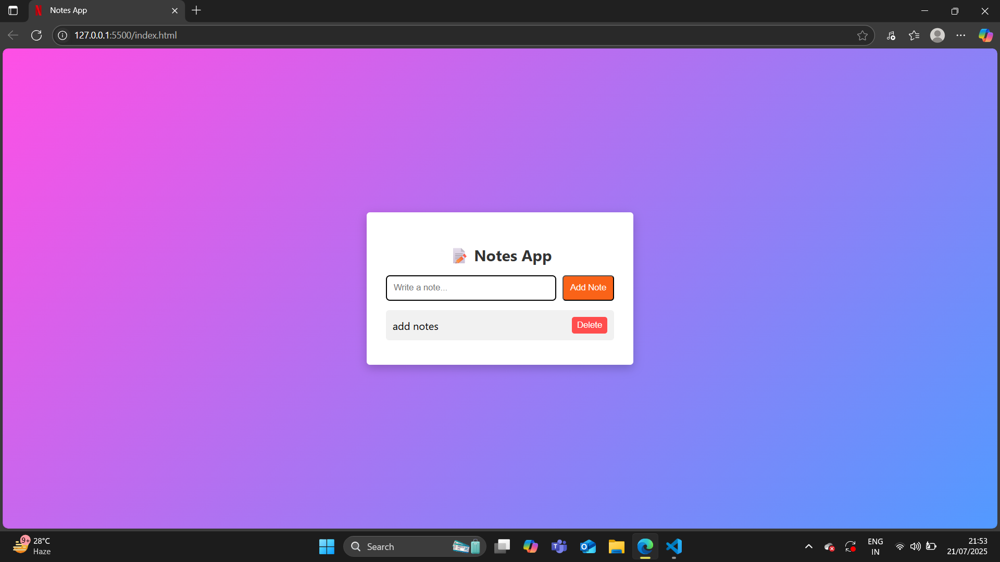

# Notes App 📝

A simple **Notes App** built with **HTML, CSS, and JavaScript**.  
You can add, delete, and store notes in **local storage**, so your notes will stay even after refreshing the page.

---

## 🚀 Features
- Add and delete notes.
- Stores notes in **Local Storage**.
- Fully responsive and clean UI.
- No database or backend required.

---

## 🛠️ Technologies Used
- **HTML5**  
- **CSS3**  
- **JavaScript (ES6)**  
- **LocalStorage API**

---

## 📸 Screenshots

---

## 🔗 Live Demo
[Click here to see Live Demo](https://notevibee-app.netlify.app/)

---

## ✨ Future Enhancements
- Add edit functionality for notes.
- Dark/light theme toggle.
- Notes categorization.
